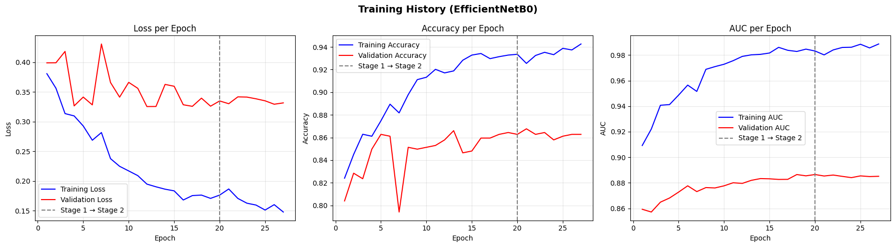
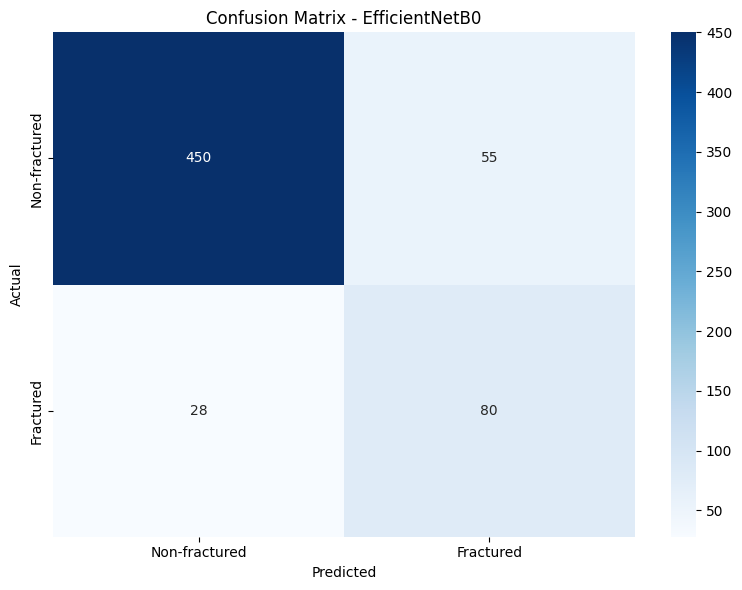
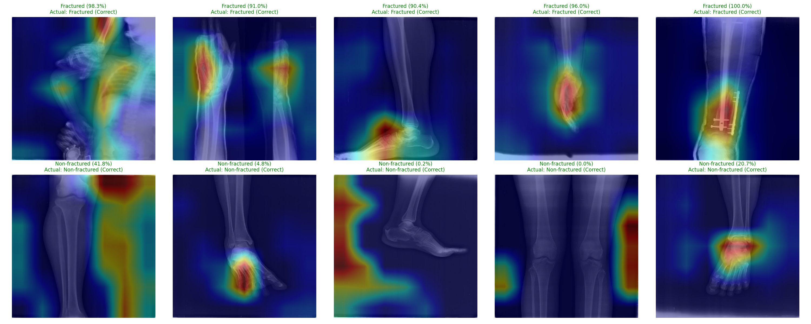

# 🦴 Bone Fracture Detection with Grad-CAM

Bone fracture detection from X-ray images using deep learning, 
computer vision & explainable AI.

[](https://huggingface.co/spaces/sabinshamsul/bone-fracture-detection)
[](https://www.python.org/)
[](https://www.tensorflow.org/)
[](LICENSE)

---

## 🎯 Live Demo!

**[👉 Live Demo on HuggingFace](https://huggingface.co/spaces/sabinshamsul/bone-fracture-detection)**

Upload any X-ray image (hand, leg, hip, or shoulder) and get:
- Fracture prediction with confidence score
- Grad-CAM heatmap showing WHERE the model detected the fracture

---

## 📊 Results

| Metric | Score |
|---|---|
| **Overall Accuracy** | 86% |
| **Fracture Recall** | 74% |
| **Validation AUC** | 0.89 |

### Training History


### Confusion Matrix


---

## 🔥 Grad-CAM (Explainable AI)

This CV project does not only predict, it shows **WHY**.



Grad-CAM enable regions of the X-ray that most influenced the 
model's prediction to be highlighted. Analysis of 10 sample predictions showed the model primarily attends to clinically relevant regions such asbone shafts, joints, 
and surgical hardware like screws/plates (indicating prior fracture repair).

**Interesting Finding:** 2 out of 10 samples showed the model focusing on image border artifacts rather than anatomy, likely related to CLAHE preprocessing creating high-contrast edges. This is a limitation that is acknowledged.

---

## 🛠️ Tech Stack

- **Model:** EfficientNetB0 (transfer learning, ImageNet pretrained)
- **Preprocessing:** OpenCV & CLAHE (contrast enhancement for X-rays)
- **Training:** TensorFlow/Keras, two-stage transfer learning
- **Interpretability:** Grad-CAM
- **Deployment:** Gradio & HuggingFace
- **Dataset:** [FracAtlas](https://figshare.com/articles/dataset/The_dataset/22363012) 
   (4,083 musculoskeletal X-ray images from 3 hospitals)

---

## 📁 Project Structure
```
Bone-Fracture-Detection/
├── notebook/
│   └── training.ipynb # Full training pipeline (Colab GPU)
├── src/
│   ├── preprocess.py  # OpenCV + CLAHE + tf.data pipeline
│   ├── model.py       # EfficientNetB0 architecture + training
│   ├── gradcam.py     # Grad-CAM implementation
│   └── predict.py     # CLI inference tool
├── demo_images/       # Sample X-rays for testing
├── results/           # Training graphs, confusion matrix, Grad-CAM outputs
└── requirements.txt
```

---

## 🚀 Running Locally

```bash
# Clone the repo
git clone https://github.com/sabinshamsul/Bone-Fracture-Detection.git
cd Bone-Fracture-Detection

# Set up environment
python -m venv venv
venv\Scripts\activate  # For Windows
pip install -r requirements.txt

# Run inference on your own images
python -m src.predict path/to/xray1.jpg path/to/xray2.jpg path/to/xray3.jpg
```

---

## ⚠️ Limitations & Future Work

- **Class imbalance:** FracAtlas has 717 fractured vs 3,366 non-fractured images (17.6% vs 82.4%), this is addressed via class weighting, but a larger fractured sample would improve recall further.
- **Shortcut learning:** Grad-CAM analysis revealed potential reliance on image border artifacts in some cases. Future work to include border-cropping during preprocessing & cross-validation with Integrated Gradients.
- **Single-label classification:** Current model performs binary classification only. The dataset includes body-region labels like hand,leg,hip & shoulder that could enable multi-task learning.

---